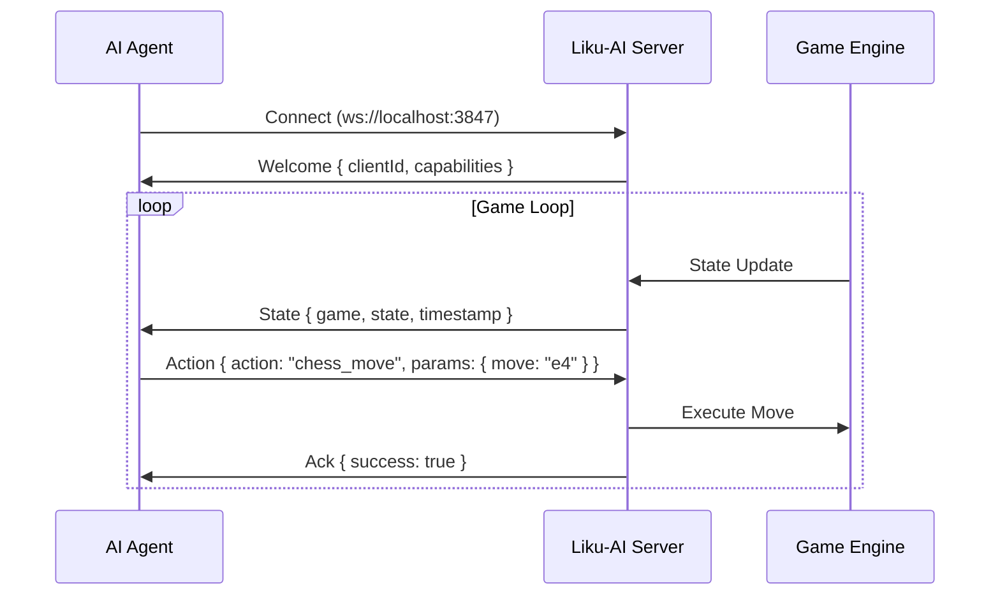
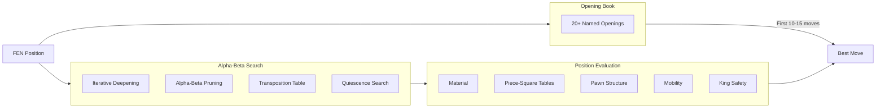
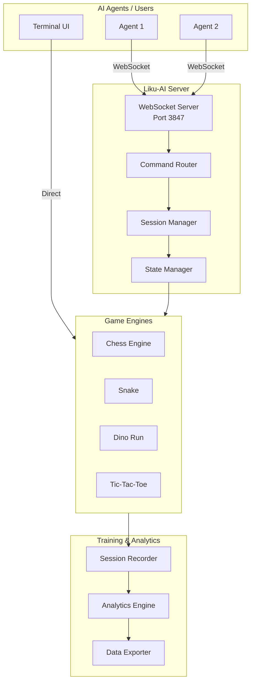

<div align="center">

```
██╗     ██╗██╗  ██╗██╗   ██╗       █████╗ ██╗
██║     ██║██║ ██╔╝██║   ██║      ██╔══██╗██║
██║     ██║█████╔╝ ██║   ██║█████╗███████║██║
██║     ██║██╔═██╗ ██║   ██║╚════╝██╔══██║██║
███████╗██║██║  ██╗╚██████╔╝      ██║  ██║██║
╚══════╝╚═╝╚═╝  ╚═╝ ╚═════╝       ╚═╝  ╚═╝╚═╝
```

# Liku-AI

**AI-Enhanced Terminal Game Platform with Real-Time WebSocket Communication**

[](https://nodejs.org/)
[](https://www.typescriptlang.org/)
[](https://vitest.dev/)
[](LICENSE)

[Quick Start](#-quick-start) •
[Features](#-features) •
[Documentation](#-documentation) •
[API Reference](docs/API_REFERENCE.md) •
[Contributing](#-contributing)

</div>

---

## 🎯 Overview

Liku-AI is a real-time AI agent platform featuring:

- **🎮 Terminal Games** — Chess, Snake, Dino Run, Tic-Tac-Toe, and more
- **🔌 WebSocket API** — Sub-millisecond latency for AI agent control
- **♟️ Chess Engine** — Alpha-beta search with 20+ openings and Elo rating
- **📊 Training Tools** — Session recording, replay, and A/B testing

```
    +---------------------------------------+
    |           LIKU-AI  CHESS              |
    +---------------------------------------+
    |                                       |
    |       a   b   c   d   e   f   g   h   |
    |     +---+---+---+---+---+---+---+---+ |
    |   8 | r | n | b | q | k | b | n | r | |  Black (k)
    |     +---+---+---+---+---+---+---+---+ |  Captured: P
    |   7 | p | p | p | p |   | p | p | p | |
    |     +---+---+---+---+---+---+---+---+ |
    |   6 |   |   |   |   |   |   |   |   | |
    |     +---+---+---+---+---+---+---+---+ |
    |   5 |   |   |   |   | p |   |   |   | |  Eval: +0.35
    |     +---+---+---+---+---+---+---+---+ |
    |   4 |   |   |   |   | P |   |   |   | |
    |     +---+---+---+---+---+---+---+---+ |
    |   3 |   |   |   |   |   | N |   |   | |
    |     +---+---+---+---+---+---+---+---+ |
    |   2 | P | P | P | P |   | P | P | P | |  White (K) to move
    |     +---+---+---+---+---+---+---+---+ |  Captured: p
    |   1 | R | N | B | Q | K | B |   | R | |
    |     +---+---+---+---+---+---+---+---+ |
    |       a   b   c   d   e   f   g   h   |
    |                                       |
    +---------------------------------------+
    | Nf3  |  Italian Game  |  Depth: 6     |
    +---------------------------------------+
```

---

## 🚀 Quick Start

### Prerequisites

- **Node.js 20.x** or higher
- **npm 10.x** or higher

### Installation

```bash
# Clone the repository
git clone https://github.com/TayDa64/Liku-AI.git
cd Liku-AI

# Install dependencies
npm install

# Build
npm run build

# Run
npm start
```

### First Run

Navigate with **arrow keys**, select with **Enter**, press **Escape** to go back.

```bash
# Start the terminal UI
npm start

# Or start WebSocket server only
npm run server
```

---

## ✨ Features

### 🎮 Terminal Games

| Game | Description | AI Support |
|------|-------------|------------|
| ♟️ **Chess** | Full engine with difficulty levels | ✅ Minimax + Opening Book |
| 🐍 **Snake** | Classic snake with pathfinding hints | ✅ State-based AI |
| 🦖 **Dino Run** | Chrome dinosaur clone | ✅ Obstacle prediction |
| ⭕ **Tic-Tac-Toe** | With minimax AI | ✅ Perfect play AI |
| 📝 **Hangman** | Word guessing | ❌ Human only |
| 🔢 **Sudoku** | Number puzzle | ❌ Human only |

### 🔌 WebSocket API

Real-time bidirectional communication for AI agents:



### ♟️ Chess Engine



**Performance:**

| Depth | NPS | Time | Estimated Elo |
|-------|-----|------|---------------|
| 2 | ~300 | <1s | ~1000 |
| 3 | ~170 | ~2s | ~1200 |
| 4 | ~140 | ~5s | ~1400 |
| 5 | ~100 | ~15s | ~1600 |

### 📊 Training & Analytics

- **Session Recording** — Capture every frame, action, and reward
- **Multi-format Export** — JSON, CSV, TFRecord, JSONL
- **Elo Rating System** — Track agent skill progression
- **A/B Testing** — Compare AI strategies with statistical significance
- **Self-Play** — Generate training data from AI vs AI games

---

## 🎮 Usage

### Terminal UI

```bash
npm start
```

**Key Commands:**

| Key | Action |
|-----|--------|
| `↑` `↓` `←` `→` | Navigate / Move |
| `Enter` | Select / Confirm |
| `Escape` | Back / Exit |
| `Space` | Jump (Dino) |
| `h` | Hint (Chess) |
| `u` | Undo (Chess) |
| `r` | Resign (Chess) |

### WebSocket Client

```typescript
import { LikuAIClient } from 'liku-ai';

const client = new LikuAIClient('ws://localhost:3847');

// Receive game state
client.on('state', (state) => {
  console.log('Current state:', state);
});

// Send commands
client.sendAction('chess_move', { move: 'e4' });

// Query data
const stats = await client.query('stats');
```

### Chess AI Battle

```bash
# AI vs AI chess match
node scripts/chess-ai-battle.js --white=minimax --black=minimax --depth=4

# Self-play training data generation
npx tsx scripts/self-play.ts --games 20 --depth-range 2-4

# Estimate Elo from games
npx tsx scripts/elo-estimate.ts --verbose
```

### CLI Commands

```bash
# Available commands
npm start           # Terminal UI
npm run server      # WebSocket server only
npm run agent       # Agent info tool
npm run autoplay    # Auto-play games

# Development
npm run dev         # Watch mode
npm test            # Run tests
npm run build       # Compile TypeScript
```

---

## 📊 Performance

| Metric | Value | Notes |
|--------|-------|-------|
| WebSocket Latency | **~1ms** | State broadcast |
| Command Latency | **~2ms** | Action → Response |
| Concurrent Clients | **1000+** | Load tested |
| Memory per Client | **~10KB** | Efficient |
| Chess NPS | **100-300** | chess.js limited |
| Test Coverage | **95%+** | 514 tests |

---

## 🏗️ Architecture



### Project Structure

```
liku-ai/
├── src/
│   ├── chess/           # Chess engine (Search, Eval, AI, Openings)
│   ├── websocket/       # WebSocket server, client, router
│   ├── training/        # Recording, replay, analytics, A/B testing
│   ├── ui/games/        # Game components (Chess, Snake, Dino, TicTacToe)
│   ├── core/            # State logging, database tools
│   └── index.tsx        # Entry point
├── scripts/             # Utility scripts (chess-ai-battle, self-play, elo-estimate)
├── docs/                # Documentation
├── __tests__/           # Test files
├── k8s/                 # Kubernetes manifests
├── Dockerfile           # Production container
└── docker-compose.yml   # Local dev stack
```

---

## 🐳 Docker

```bash
# Build image
docker build -t liku-ai .

# Run container
docker run -p 3847:3847 -p 3848:3848 liku-ai

# Docker Compose (with Redis)
docker-compose up
```

---

## 🧪 Testing

```bash
# Run all tests
npm test

# Run once (CI mode)
npm run test:run

# Specific test file
npx vitest run __tests__/WebSocket.test.ts
```

**Test Coverage:**

| Module | Tests | Coverage |
|--------|-------|----------|
| WebSocket | 179 | ~95% |
| Training | 93 | ~95% |
| Spectator | 93 | ~95% |
| Security | 43 | ~90% |
| TURN | 40 | ~90% |
| **Total** | **514** | **~95%** |

---

## 📚 Documentation

| Document | Description |
|----------|-------------|
| [Quick Reference](docs/QUICK_REFERENCE.md) | One-page command cheatsheet |
| [API Reference](docs/API_REFERENCE.md) | Complete WebSocket API |
| [WebSocket Protocol](docs/WEBSOCKET_PROTOCOL.md) | Protocol specification |
| [Troubleshooting](docs/TROUBLESHOOTING.md) | Common issues & solutions |
| [Performance](docs/PERFORMANCE.md) | Load test results |
| [AI Battle Guide](docs/AI_BATTLE_GUIDE.md) | AI vs AI games |
| [Development Roadmap](TODO.md) | Planned features |
| [Chess Implementation](todo-chess.md) | Chess engine details |

---

## 🔧 Configuration

### Environment Variables

| Variable | Default | Description |
|----------|---------|-------------|
| `LIKU_WS_PORT` | `3847` | WebSocket server port |
| `LIKU_HEALTH_PORT` | `3848` | Health endpoint port |
| `GEMINI_API_KEY` | — | For AI move explanations |

### CLI Flags

```bash
npm start -- --no-websocket  # Disable WebSocket server
npm start -- --port 8080     # Custom port
```

---

## 🤝 Contributing

1. Fork the repository
2. Create a feature branch (`git checkout -b feature/amazing-feature`)
3. Commit your changes (`git commit -m 'Add amazing feature'`)
4. Push to the branch (`git push origin feature/amazing-feature`)
5. Open a Pull Request

See [CONTRIBUTING.md](CONTRIBUTING.md) for detailed guidelines.

---

## 📜 License

MIT License — see [LICENSE](LICENSE) for details.

---

## 🙏 Acknowledgments

- [chess.js](https://github.com/jhlywa/chess.js) — Chess move generation
- [Ink](https://github.com/vadimdemedes/ink) — React for CLI
- [chalk](https://github.com/chalk/chalk) — Terminal styling
- [Chess Programming Wiki](https://www.chessprogramming.org/) — Engine algorithms

---

<div align="center">

**Version**: 2.3.1 • **Tests**: 514 passing • **Last Updated**: December 2025

[⬆ Back to top](#liku-ai)

</div>
